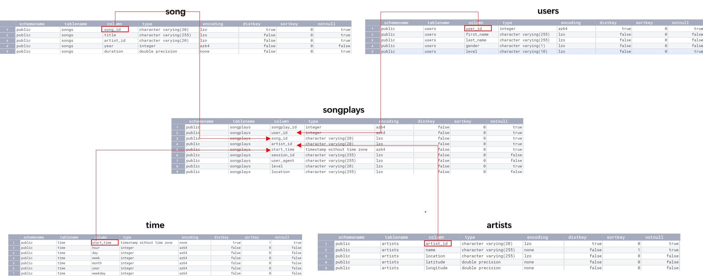
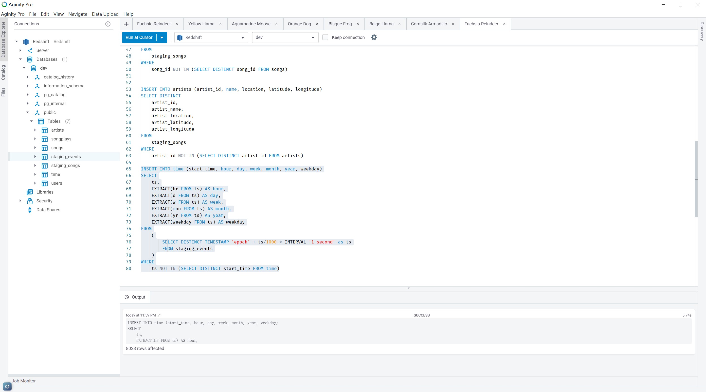
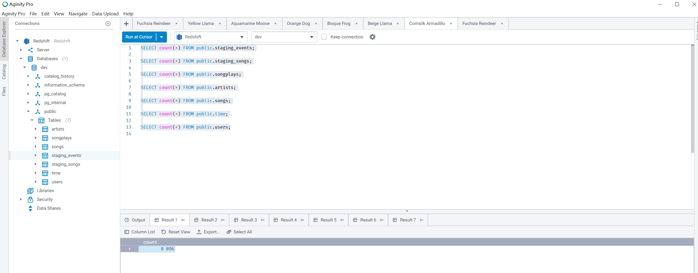

# Data Warehouse with Postgres

Build an Data Warehouse using Python on AWS Redshift And Copy Data from S3 bucket.


### Table of Contents

1. [Installation](#installation)
2. [Project Motivation](#motivation)
3. [File Descriptions](#files)
4. [Run](#results)
5. [Licensing, Authors, and Acknowledgements](#licensing)

## Installation <a name="installation"></a>


[Installing Psycopg2](https://www.psycopg.org/)
```
# Requires the latest pip
pip3 install -U pip
pip3 install pyscopg2
```


[Installing configparser](https://docs.python.org/3/library/configparser.html)
```
pip3 install configparser
```


## Project Motivation<a name="motivation"></a>
A music streaming startup, Sparkify, has grown their user base and song database and want to move their processes and data onto the cloud. Their data resides in S3, in a directory of JSON logs on user activity on the app, as well as a directory with JSON metadata on the songs in their app.

Building an ETL pipeline that extracts their data from S3, stages them in Redshift, and transforms data into a set of dimensional tables for their analytics team to continue finding insights in what songs their users are listening to. 

### Fact table and Dimension table with star schemas


### Aginity for debug SQL queries 


### Data quality checks by Aginity


## File Descriptions <a name="files"></a>

```
- sql_queries.py # sql 
- etl.py  # load data from s3 bucket into Staging table, then ETL data from staging tables to star schemas tables of DWH .
- create_tables.py # create Staging tables and Star Schemas tables
- README.md
- sql_queries.py SQL commands to create tables and ETL data
```

## Run <a name="results"></a>

```
python3 create_tables.py 

python3 etl.py 

```
Then check the table by test.ipynb


## Licensing, Authors, and Acknowledgements <a name="licensing"></a>

### Built With
* [Psycopg2](https://www.psycopg.org/) - Psycopg is the most popular PostgreSQL adapter for the Python.
* [Million Song Dataset](http://millionsongdataset.com/)
* [Event simulator](https://github.com/Interana/eventsim)

### Versioning

* We use [SemVer](http://semver.org/) for versioning. For the versions available, see the [tags on this repository](https://github.com/your/project/tags).

### Authors

* **Tom Ge** - *Fullstack egineer* - [github profile](https://github.com/tomgtqq)

### License

* This project is licensed under the MIT License
